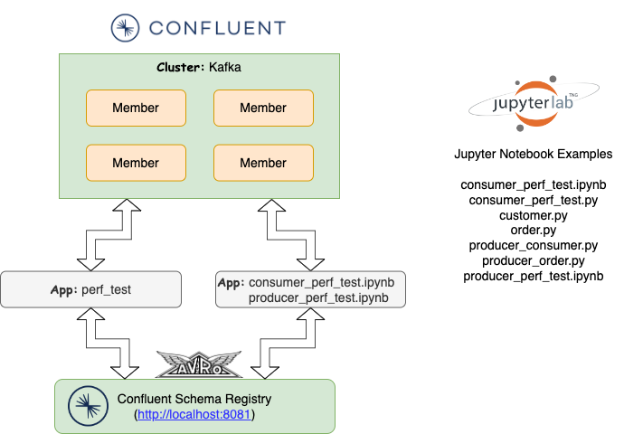

 [*PadoGrid*](https://github.com/padogrid) | [*Catalogs*](https://github.com/padogrid/catalog-bundles/blob/master/all-catalog.md) | [*Manual*](https://github.com/padogrid/padogrid/wiki) | [*FAQ*](https://github.com/padogrid/padogrid/wiki/faq) | [*Releases*](https://github.com/padogrid/padogrid/releases) | [*Templates*](https://github.com/padogrid/padogrid/wiki/Using-Bundle-Templates) | [*Pods*](https://github.com/padogrid/padogrid/wiki/Understanding-Padogrid-Pods) | [*Kubernetes*](https://github.com/padogrid/padogrid/wiki/Kubernetes) | [*Docker*](https://github.com/padogrid/padogrid/wiki/Docker) | [*Apps*](https://github.com/padogrid/padogrid/wiki/Apps) | [*Quick Start*](https://github.com/padogrid/padogrid/wiki/Quick-Start)

---

<!-- Platforms -->
[](https://github.com/padogrid/padogrid/wiki/Platform-Host-OS) [](https://github.com/padogrid/padogrid/wiki/Platform-VM) [](https://github.com/padogrid/padogrid/wiki/Platform-Docker) [](https://github.com/padogrid/padogrid/wiki/Platform-Kubernetes)

# Confluent JupyterLab Python Examples

This bundle provides Kafka Python client examples running on JupyterLab in PadoGrid. It demonstrates how PadoGrid workspaces are seamlessly integrated with JupyterLab workspaces.

## Installing Bundle

```bash
install_bundle -download -workspace bundle-confluent-7-examples-python
```

## Use Case

This bundle provides step-by-step instructions for creating a JupyterLab environment in PadoGrid and executing Kafka Python clients in Jupyter Notebook that writes and reads to/from a local Kafka cluster. It relies on Confluent Schema Registry for serializing Avro data. As such, it requires Confluent installation. Note that we can run the cluster and clients using either Kafka or Confluent. We need Confluent only for running Schema Registry.



## Required Software

- PadoGrid 0.9.22+
- Confluent 7.0.0+
- Python 3.x
- JupyterLab

## Installing JupyterLab

Install JupyterLab on your machine as described in the following section in the PadoGrid manual.

[JupyterLab](https://github.com/padogrid/padogrid/wiki/JupyterLab)

## Startup Sequence

1. Start JupyterLab

```bash
open_jupyter
```

2. Switch workspace in each terminal

Due to JupyterLab limitations, the terminals shown in the browser are not in the PadoGrid workspace context. Execute the following in each terminal to switch to the PadoGrid workspace. Make sure to replace `<your_rwe>` with your RWE name.

```bash
switch_rwe <your_rwe>/bundle-confluent-7-examples-python
```

3. Start cluster

From one of the terminals in the browser, create and start a Kafka cluster.

```bash
make_cluster -product confluent
switch_cluster myconfluent
start_cluster
```

4. Start Confluent Schema Registry

```bash
schema-registry-start $CONFLUENT_HOME/etc/schema-registry/schema-registry.properties
```

5. Install Kafka Python client package

```bash
# Install Confluent Kafka API
pip install confluent-kafka

# Our examples require avro
pip install avro
pip install fastavro
```

6. Create and build `perf_test`

PadoGrid includes `perf_test` for ingesting Avro-based mock data into Kafka.

```bash
create_app -product kafka
cd_app perf_test/bin_sh
./build_app
```

7. Ingest data

From another terminal, run `test_group` to ingest data into `nw.customers` and `nw.orders`.

```bash
cd_app perf_test/bin_sh
./test_group -run -prop ../etc/group-factory.properties
```

You should see outputs from the `subscribe_topic` command similar to the following.

```console
...
k0000000998: {"createdOnMillis": 1665875842097, "updatedOnMillis": 1665875842097, "orderId": "k0000000998", "customerId": "596932+1747", "employeeId": "262691+0055", "orderDateMillis": 1665579937975, "requiredDateMillis": 1666027190635, "shippedDateMillis": 1666007789378, "shipVia": "2", "freight": 81.32, "shipName": "Frami-McLaughlin", "shipAddress": "036 Muller Wall, North Shadland, TN 37139", "shipCity": "Jeffereyburgh", "shipRegion": "WY", "shipPostalCode": "78960-5346", "shipCountry": "Comoros"}, org.kafka.demo.nw.data.avro.generated.__Order
k0000000120: {"createdOnMillis": 1665875842097, "updatedOnMillis": 1665875842097, "orderId": "k0000000120", "customerId": "653461+9089", "employeeId": "414175-8292", "orderDateMillis": 1665382721152, "requiredDateMillis": 1666345723057, "shippedDateMillis": 1665477669794, "shipVia": "4", "freight": 80.46, "shipName": "Schneider Inc", "shipAddress": "687 Lacy Track, New Claretta, OK 21334-2746", "shipCity": "Lake Babara", "shipRegion": "VA", "shipPostalCode": "27636", "shipCountry": "Ghana"}, org.kafka.demo.nw.data.avro.generated.__Order
k0000000124: {"createdOnMillis": 1665875842099, "updatedOnMillis": 1665875842099, "orderId": "k0000000124", "customerId": "744165-5231", "employeeId": "421037+7957", "orderDateMillis": 1665569649734, "requiredDateMillis": 1667306526370, "shippedDateMillis": 1665667859258, "shipVia": "1", "freight": 88.05, "shipName": "Reichel, Paucek and Crist", "shipAddress": "Apt. 141 39353 Nan Prairie, East Manual, MI 28345-5295", "shipCity": "Marilouburgh", "shipRegion": "MN", "shipPostalCode": "66935", "shipCountry": "Zambia"}, org.kafka.demo.nw.data.avro.generated.__Order
...
```

8. Subscribe topics

Run `subscribe_topic` to monitor data being ingested into Kafka. We will ingest data into two topics: `nw.customers` and `nw.orders`.

```bash
cd_app perf_test/bin_sh
./subscribe_topic nw.customers
./subscribe_topic nw.orders
```

:pencil2: Unlike other Kafka consumer applications, `subscribe_topic` does not create topics if they do not exist. You must first create topics before you can make subscriptions. This means you must first run `test_group` to create topics and produce data before running `subscribe_topic`.

9. Ingest data again to see `subscribe_topic` consuming data.

- Follow Step 7

10. View Python source code

So far, we used Java apps included in PadoGrid. Let's now turn to Python. You can view the `apps/python_examples` directory from JupyterLab or from a terminal as follows.

```bash
cd_app python_examples
tree
```

Output:

```console
.
├── ccloud_lib.py
├── consumer_perf_test.ipynb
├── consumer_perf_test.py
├── customer.py
├── etc
│   ├── avro
│   │   ├── blob.avsc
│   │   ├── category.avsc
│   │   ├── customer.avsc
│   │   ├── employee-territory.avsc
│   │   ├── employee.avsc
│   │   ├── order-detail.avsc
│   │   ├── order.avsc
│   │   ├── product.avsc
│   │   ├── region.avsc
│   │   ├── shipper.avsc
│   │   ├── supplier.avsc
│   │   └── territory.avsc
│   ├── kafka-consumer.properties
│   └── kafka-producer.properties
├── order.py
├── producer_customer.py
├── producer_order.py
└── producer_perf_test.ipynb
```

The included files are described below.

| File                            | Description                      |
| ------------------------------- | -------------------------------- |
| `customer.py`                   | The `Customer` class that serializes/deserializes Avro payloads. Note that Avro data fields are provided in a dictionary. |
| `order.py`                      | The `Order` class that serializes/deserializes Avro payloads. Note that Avro data fields are provided in a dictionary.    |
| `producer_customer.py`          | Produces `Customer` objects in the specified topic |
| `producer_order.py`             | Produces `Order` objects in the specified topic    |
| `consumer_perf_test.py`         | Consumes objects from the specified topic and displays them |
| `consumer_perf_test.ipynb`      | Jupyter Notebook for running `consumer_perf_test.py` |
| `producer_perf_test.ipynb`      | Jupyter Notebook for running `producer_perf_test.py` |
| `etc/avro/*`                    | Avro schemas used by `perf_test`. Only `customer.asvc` and `order.avsc` are used for in this tutorial. |
| `etc/kafka-consumer.properties` | Consumer specific properties     |
| `etc/kafka-producer.properties` | Producer specific properties     |

11. Run Jupyter Notebook examples

- Change folder: `apps/python_examples`
- Open and run `consumer_perf_test.ipynb`
- Open and run `producer_customer.ipynb`
- Open and run `producer_order.ipynb`

:pencil2: The `ccloud_lib.py` file found in `apps/python_examples` is part of the Confluent examples downlodable from the Confluent GitHub repo. Please see the [Confluent Examples](#Confluent-Examples) section for details.

12. Run Python from terminal

Subscribe `nw.customers`

```bash
cd_app python_examples
./consumer_perf_test.py -f etc/kafka-consumer.properties -t nw.customers
```

Subscribe `nw.orders`

```bash
cd_app python_examples
./consumer_perf_test.py -f etc/kafka-consumer.properties -t nw.orders
```

Ingest data into `nw.customers`

```bash
cd_app python_examples
./producer_customer.py -f etc/kafka-producer.properties -t nw.customers
```

Ingest data into `nw.orders`

```bash
cd_app python_examples
./producer_order.py -f etc/kafka-producer.properties -t nw.orders
```

You can also run `perf_test` to produce and consume data as before. Both Java and Python apps can produce and consume data using the topics, `nw.customers` and `nw.orders`.

Consume Python generated data using `perf_test` (Java):

```bash
cd_app perf_test/bin_sh
./subscribe_topic nw.customers
./subscribe_topic nw.orders
```

Produce data using Java for the Python consumer:

```bash
cd_app perf_test/bin_sh
./test_group -run -prop ../etc/group-factory.properties
```

## Confluent Examples

Confluent provides client examples that you can also try out in this tutorial. This section provides instructions for downloading and running Confluent examples. We'll focus on Java examples only.

1. Clone Confluent examples

Download the Confluent client examples.

```bash
cd_app python_examples
git clone https://github.com/confluentinc/examples.git
```

2. Build Java examples

From a terminal, run the following:

```bash
cd_app python_examples/examples/clients/avro
mvn clean compile package
```

There is a bug in the `pom.xml` file that may output the following error.

```console
...
[ERROR] 'dependencies.dependency.version' for org.slf4j:slf4j-log4j12:jar is missing. @ line 71, column 17
[ERROR] 'dependencies.dependency.version' for io.confluent:confluent-log4j:jar is missing. @ line 76, column 17
...
```

If you see the errors shown above, then add version numbers in the `pom.xml` as shown below.

```xml
   ...
   <dependency>
       <groupId>org.slf4j</groupId>
       <artifactId>slf4j-log4j12</artifactId>
       <version>2.0.3</version>
   </dependency>
   ...
   <dependency>
       <groupId>io.confluent</groupId>
       <artifactId>confluent-log4j</artifactId>
       <version>1.2.17-cp10</version>
   </dependency>
   ...
```

3. Optional: Start Confluent Control Center

Optionally, you can start Confluent Control Center to create and monitor topics.

```bash
control-center-start $CONFLUENT_HOME/etc/confluent-control-center/control-center.properties
```

4. Optional: Check Confluent Control Center

- URL: http://localhost:9021
- Select the **transactions** topic
- Select the **Messages** tab to monitor the **transactions** messages.

5. Run Java consumer

From a terminal, run the following:

```bash
cd_app python_examples/examples/clients/avro
mvn exec:java -Dexec.mainClass=io.confluent.examples.clients.basicavro.ConsumerExample \
              -Dexec.args="../../../etc/kafka-consumer.properties"
```

6. Run Java publisher

From a terminal, run the following:

```bash
cd_app python_examples/examples/clients/avro
mvn exec:java -Dexec.mainClass=io.confluent.examples.clients.basicavro.ProducerExample \
              -Dexec.args="../../../etc/kafka-producer.properties"
```

## Confluent Schema Registry REST API

This section provides Schema Resitry REST API examples obtained from [1]. From your terminal, set `TOPIC` to the name of topic that you want to apply the examples.

- URL: http://localhost:8081/

```bash
# topic 
TOPIC="mytopic"
```

- List all subjects

```bash
curl -sX GET http://localhost:8081/subjects | jq .
```

- Register a new version of a schema under the subject "$TOPIC-key"

```bash
curl -sX POST -H "Content-Type: application/vnd.schemaregistry.v1+json" \
    --data '{"schema": "{\"type\": \"string\"}"}' \
    http://localhost:8081/subjects/$TOPIC-key/versions | jq .
```

- Register a new version of a schema under the subject "$TOPIC-value"

```bash
curl -sX POST -H "Content-Type: application/vnd.schemaregistry.v1+json" \
    --data '{"schema": "{\"type\": \"string\"}"}' \
     http://localhost:8081/subjects/$TOPIC-value/versions | jq .
```

- List all schema versions registered under the subject "$TOPIC-value"

```bash
curl -sX GET http://localhost:8081/subjects/$TOPIC-value/versions | jq .
```

- Fetch a schema by globally unique id 1

```bash
curl -sX GET http://localhost:8081/schemas/ids/1 | jq .
```

- Fetch version 1 of the schema registered under subject "$TOPIC-value"

```bash
curl -sX GET http://localhost:8081/subjects/$TOPIC-value/versions/1 | jq .
```

- Fetch the most recently registered schema under subject "$TOPIC-value"

```bash
curl -sX GET http://localhost:8081/subjects/$TOPIC-value/versions/latest | jq .
```

- Check whether a schema has been registered under subject "$TOPIC-key"

```bash
curl -X POST -H "Content-Type: application/vnd.schemaregistry.v1+json" \
    --data '{"schema": "{\"type\": \"string\"}"}' \
    http://localhost:8081/subjects/$TOPIC-key | jq .
```

- Test compatibility of a schema with the latest schema under subject "$TOPIC-value"

```bash
curl -sX POST -H "Content-Type: application/vnd.schemaregistry.v1+json" \
    --data '{"schema": "{\"type\": \"string\"}"}' \
    http://localhost:8081/compatibility/subjects/$TOPIC-value/versions/latest | jq .
```

- Get top level config

```bash
curl -sX GET http://localhost:8081/config | jq .
```

- Update compatibility requirements globally

```bash
curl -sX PUT -H "Content-Type: application/vnd.schemaregistry.v1+json" \
    --data '{"compatibility": "NONE"}' \
    http://localhost:8081/config | jq .
```

- Update compatibility requirements under the subject "$TOPIC-value"

```bash
curl -sX PUT -H "Content-Type: application/vnd.schemaregistry.v1+json" \
    --data '{"compatibility": "BACKWARD"}' \
    http://localhost:8081/config/$TOPIC-value | jq .
```

- Delete version 3 of the schema registered under subject "$TOPIC-value"

```bash
curl -sX DELETE http://localhost:8081/subjects/$TOPIC-value/versions/3 | jq .
```

- Delete all versions of the schema registered under subject "$TOPIC-value"

```bash
curl -sX DELETE http://localhost:8081/subjects/$TOPIC-value | jq .
```

## Teardown

```bash
kill_cluster
stop_jupyter
```

## References

1. *Confluent Schema Registry Source*, https://github.com/confluentinc/schema-registry
2. *On-Premises Schema Registry Tutorial*, Confluent Inc., https://docs.confluent.io/platform/current/schema-registry/schema_registry_onprem_tutorial.html#on-premises-sr-tutorial
3. *Confluent Examples*, Confluent Inc., https://github.com/confluentinc/examples.git

---

 [*PadoGrid*](https://github.com/padogrid) | [*Catalogs*](https://github.com/padogrid/catalog-bundles/blob/master/all-catalog.md) | [*Manual*](https://github.com/padogrid/padogrid/wiki) | [*FAQ*](https://github.com/padogrid/padogrid/wiki/faq) | [*Releases*](https://github.com/padogrid/padogrid/releases) | [*Templates*](https://github.com/padogrid/padogrid/wiki/Using-Bundle-Templates) | [*Pods*](https://github.com/padogrid/padogrid/wiki/Understanding-Padogrid-Pods) | [*Kubernetes*](https://github.com/padogrid/padogrid/wiki/Kubernetes) | [*Docker*](https://github.com/padogrid/padogrid/wiki/Docker) | [*Apps*](https://github.com/padogrid/padogrid/wiki/Apps) | [*Quick Start*](https://github.com/padogrid/padogrid/wiki/Quick-Start)
